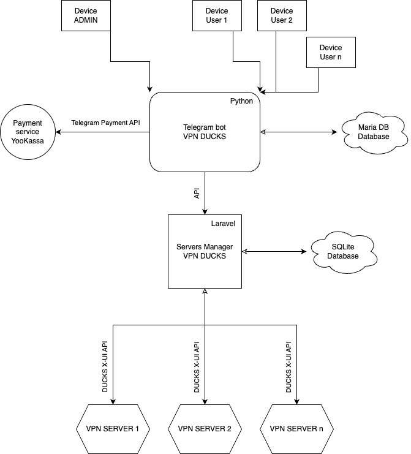

# 🦆 DUCKS VPN
## _The Best Telegram Vpn Service, Ever_

[](https://opensource.org/licenses/MIT)

DucksVPN is a system for VPN:
- Telegram bot for sales vpn subscribes
- DSM (Ducks Server Manager) https://github.com/milkyspace/ducks-server-manager

## Tech

Technically, the system now looks like this



And of course DUCKS VPN itself is open source with a public repository on GitHub.

## Installation

DUCKS VPN requires Python3 to run.\
You must create a bot in telegram via https://t.me/BotFather and create a store in YooKassa https://yookassa.ru/ to receive subscription payments

Install the dependencies and start the server.

```sh
apt-get install git -y
git clone https://github.com/milkyspace/ducksvpn.git
cd ducksvpn
mkdir backup
chmod u+x install.sh
./install.sh

mysql -u root -p
  # CREATE DATABASE ducksvpn;
  # GRANT ALL ON my_test_db.* TO 'admin'@'localhost' IDENTIFIED BY 'adminpassword' WITH GRANT OPTION;
  # FLUSH PRIVILEGES;
  # exit;

mysql -u admin -p
adminpassword
  # use ducksvpn
  # CREATE TABLE IF NOT EXISTS userss (id int(11) NOT NULL AUTO_INCREMENT PRIMARY KEY,tgid varchar(50) UNIQUE,subscription text,banned BOOLEAN DEFAULT FALSE NOT NULL,username varchar(50),fullname varchar(50),  referrer_id int, type varchar(20));
  # CREATE TABLE IF NOT EXISTS notions (id int(11) NOT NULL AUTO_INCREMENT PRIMARY KEY,tgid varchar(50),notion_type varchar(50) ,complete BOOLEAN DEFAULT FALSE NOT NULL,  time DATETIME DEFAULT CURRENT_TIMESTAMP);
  # CREATE TABLE IF NOT EXISTS payments (id int(11) NOT NULL AUTO_INCREMENT PRIMARY KEY,tgid varchar(50),bill_id text,amount int,time_to_add bigint, message_id bigint, chat_id bigint, status varchar(50),mesid text , time DATETIME DEFAULT CURRENT_TIMESTAMP);
  # CREATE TABLE IF NOT EXISTS gifts (id int(11) NOT NULL AUTO_INCREMENT PRIMARY KEY, sender_tgid varchar(50), recipient_tgid varchar(50), payment_id text, status varchar(50), time DATETIME DEFAULT CURRENT_TIMESTAMP);
```

## Setting up a vpn server (any number)
You can use any server
- Install https://github.com/MHSanaei/3x-ui
- Use this https://dzen.ru/a/ZriA_y2iBCnoS7dT?ysclid=m1nfklo9j5716759728
- Then use this https://github.com/keivanipchihagh/x-ui#-optional-safety-first
- Then use this https://safereactor.cc/post/5761728
- Then use this https://github.com/DigneZzZ/dwg/blob/main/tools/block_torrent.sh
- Then use this https://github.com/keivanipchihagh/x-ui/blob/main/scripts/bbr.sh
- Then use this https://github.com/keivanipchihagh/x-ui/blob/main/scripts/ufw.sh (with extreme caution)

## Load balancing across servers
- Buy a domain on https://njal.la/ for a crypt
- Register on cloudflare.com
- Move domain from njal.la to cloudflare.com
- Get an SSL certificate for the domain
- Register one a-record per domain for each VPN server (do not turn on the CDN Cloudflare)

## DSM
Now you have to install DSM (Ducks Server Manager)
- https://github.com/milkyspace/ducks-server-manager
Setting up the DSM at .env
- Set VPN_DOMAIN_FOR_LINKS. Is the domain of previous step
- Add vpn servers to the panel

You need to find out your ip address ($IP):
```sh
ip addr show
```

## Let's go back to setting up the telegram bot:
Change it .env: Enter your data using the example
```sh
mv .env.example .env
nano .env # or vim .env
```

**ADMIN_TG_ID_1** is tg id of first admin (go to @getmyid_bot)\
**ADMIN_TG_ID_2** is tg id of second admin  (go to @getmyid_bot)\
**ONE_MONTH_COST** is the price for 1 month\
**TRIAL_PERIOD** is days of trial period\
**COUNT_FREE_FROM_REFERRER** is count of months for referrer present\
**PERC_1** is calc price for 1 month\
**PERC_3** is calc price for 3 months\
**PERC_6** is calc price for 6 months\
**PERC_12** is calc price for 12 months\
**TG_TOKEN** is telegram bot token\
**TG_SHOP_TOKEN** is yookassa token\
**DB_HOST** is host of database
**DB_NAME** is name of database
**DB_USER** is user of database
**DB_PASSWORD** is password to user of database
**SERVER_MANAGER_URL** is url for server manager (for example DSM http://{IP}/api)
**SERVER_MANAGER_EMAIL** is login for server manager
**SERVER_MANAGER_PASSWORD** is password for server manager
**PAYMENT_SYSTEM_CODE** is payment system code (yookassa)
**YOOKASSA_SHOP_ID** is YooKassa shop id
**YOOKASSA_SECRET_KEY** is YooKassa API secret key
**SUPPORT_LINK** is link to support
**SUPPORT_USERNAME** is tg username of support (with @)
**BACKUP_DIR** is dir for backups

Now you can start the telegram bot

```sh
sudo systemctl start ducksVpnTelegram
sudo systemctl status ducksVpnTelegram
```

For convenience, you can add these aliases

```sh
alias dvpn="sudo systemctl stop ducksVpnTelegram && sudo systemctl start ducksVpnTelegram && sudo systemctl status ducksVpnTelegram"
alias dvpnstatus="sudo systemctl status ducksVpnTelegram"
alias dvpnstop="sudo systemctl stop ducksVpnTelegram"
alias dvpntest="python3 /var/www/ducksvpn/main.py"
alias dvpnmysql="mysql -u User -pPassword"
alias dvpndir="cd /var/www/ducksvpn"
alias sail='[ -f sail ] && sh sail || sh vendor/bin/sail'
```

## License

MIT License

Copyright (c) 2024 milkyspace

Permission is hereby granted, free of charge, to any person obtaining a copy
of this software and associated documentation files (the "Software"), to deal
in the Software without restriction, including without limitation the rights
to use, copy, modify, merge, publish, distribute, sublicense, and/or sell
copies of the Software, and to permit persons to whom the Software is
furnished to do so, subject to the following conditions:

The above copyright notice and this permission notice shall be included in all
copies or substantial portions of the Software.

THE SOFTWARE IS PROVIDED "AS IS", WITHOUT WARRANTY OF ANY KIND, EXPRESS OR
IMPLIED, INCLUDING BUT NOT LIMITED TO THE WARRANTIES OF MERCHANTABILITY,
FITNESS FOR A PARTICULAR PURPOSE AND NONINFRINGEMENT. IN NO EVENT SHALL THE
AUTHORS OR COPYRIGHT HOLDERS BE LIABLE FOR ANY CLAIM, DAMAGES OR OTHER
LIABILITY, WHETHER IN AN ACTION OF CONTRACT, TORT OR OTHERWISE, ARISING FROM,
OUT OF OR IN CONNECTION WITH THE SOFTWARE OR THE USE OR OTHER DEALINGS IN THE
SOFTWARE.

**Free Software**
